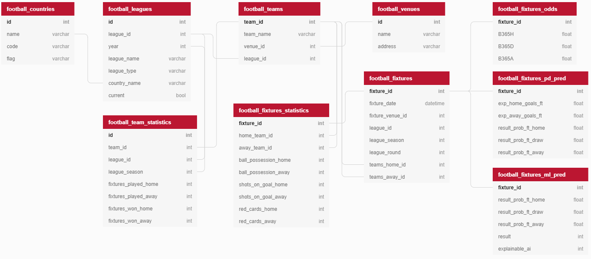
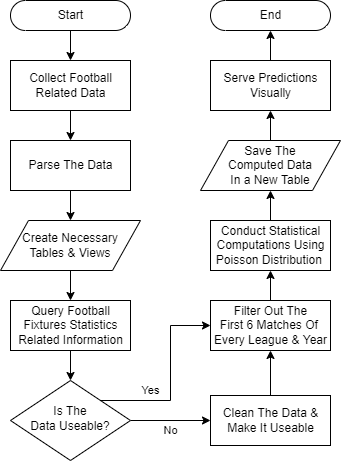
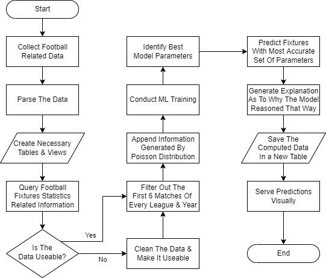
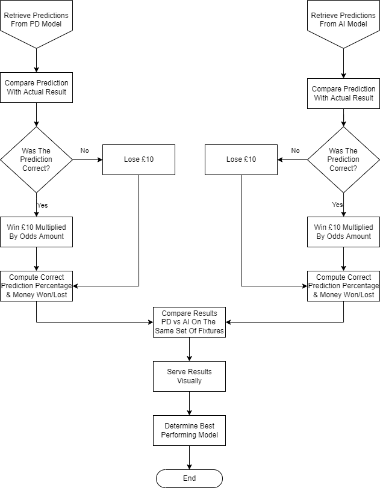
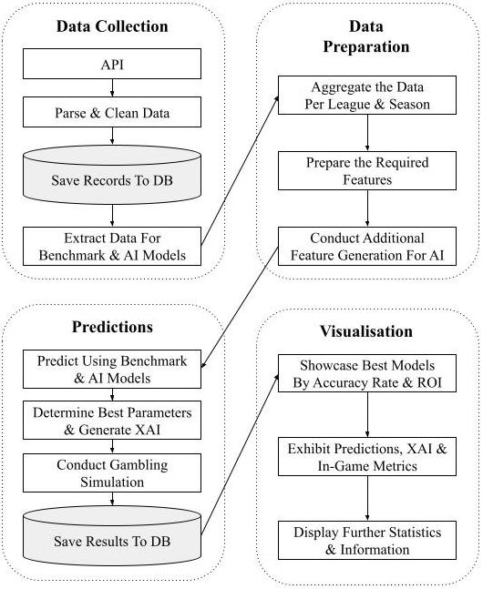

# Masters in AI - Football Predictions ⚽

This project started being developed on the 27th of September 2021 to fulfil the project requirements for my [Masters
in Artificial Intelligence](https://www.um.edu.mt/courses/overview/PMSCIARIPET7-2021-2-O). The title of such a 
dissertation was '**Predicting and Explaining Football Match Results Through Statistical Models and Artificial
Intelligence Techniques**'. In other words, the ambition for this project was to utilise statistical models, artificial
intelligence and machine learning techniques to predict football match results before they start. The main targets for
the predictions were to have a monetary profit while also providing the end user with an explanation as to why the
models reasoned that way.

Kindly note that this is a simplified repository that does not contain data collection scripts and database queries.
This was done to offer readers only with the datasets and notebooks required for the results derived by the artificial 
intelligence models. For a detailed review of the full codebase, please contact Robert at 
<a href="mailto:cassarpacerobert@gmail.com">cassarpacerobert@gmail.com</a> or at 
<a href="mailto:robert.cassar-pace.20@um.edu.mt">robert.cassar-pace.20@um.edu.mt</a>.

## Project Requirements 🔎
A lot of data development was required to reach the aforementioned targets. Some of these were:
<ul>
    <li>Collecting & Parsing Data</li>
    <li>Creating Tables From The Parsed Data</li>
    <li>Designing a Usable Data Architecture</li>
    <li>Predicting Using Statistical Models</li>
    <li>Predicting Using Machine Learning Models</li>
    <li>Providing Artificial Intelligence Explanations (XAI)</li>
</ul>

The data was mainly retrieved using [API-Football](https://www.api-football.com/) endpoints that are provided by
[RapidAPI](https://rapidapi.com/). Information that was collected was mainly parsed using [Python](https://www.python.org/)
and [MySQL](https://www.mysql.com/) queries. The jupyter notebooks containing the results obtained can be accessed within
the [code](code) directory. Within the code, one should be able to find the necessary datasets that were exported from
the database system as well as some extra content.

## Project Structure Explanation 📖

This section will explain what every folder contains. Furthermore, a description regarding some datasets will also
be outlined.

[code](code)
<ul>
    <li>pd_predictions_walkthrough</li>
        <ul>
            <li>This file utilises the <code>football_dataset_pd_features_only.csv</code> dataset and provides a brief
                explanation as to how Poisson distribution calculations were conducted</li>
            <li>Note that this notebook is not runnable since it retrieves the data directly from the database that
                was developed - however, a full CSV export is visualised at the end of the file to showcase the
                entire list of predicted matches</li>
        </ul>
    <li>ai_predictions_pd_features_only</li>
        <ul>
            <li>This file utilises the <code>football_dataset_pd_features_only.csv</code> dataset and shows how the 
                models performed with very little features</li>
            <li>Only necessary features like the IDs of the teams, league season and metrics derived from the Poisson
                distribution model were used</li>
        </ul>
    <li>ai_predictions_additional_features_xai</li>
        <ul>
            <li>This file utilises the <code>football_dataset_additional_features.csv</code> and
                <code>football_fixtures_odds.csv</code> datasets</li>
            <li>A detailed review of how the AI-based model performed is outlined in this file</li>
            <li>Accuracy rates and gambling simulations are also provided at the end of each ML model</li>
        </ul>
</ul>

[code/other_data](code/other_data)
<ul>
    <li>This folder consists of additional datasets that were explored and assessed throughout the write-up</li>
    <li>These are not used in any of the Jupyter notebooks</li>
</ul>

[code/jupyter_notebooks_html_exports](code/jupyter_notebooks_html_exports)
<ul>
    <li>These are HTML exports of the Jupyter notebooks located within the <code>code</code> folder</li>
</ul>

[diagrams](diagrams)
<ul>
    <li>Visual representations of the database architecture and flow chart processes</li>
</ul>

[requirements](requirements)
<ul>
    <li>The modules required to run the scripts provided</li>
</ul>

## Database Architecture 📅
The database diagram was created on [dbdiagram.io](https://dbdiagram.io/) and is as follows:

Tables listed above are crucial in order to provide users with accurate and factual data. Although the primary key
for every table is marked in bold, kindly note that some tables have their own _fake primary key_ when being joined to
other tables. This ensures uniqueness when joining records from one table to another. Also note that some tables have
way more fields than what is visible in the diagram above.

> ⚠️ `football_fixtures_pd_pred` and `football_fixtures_ml_pred` are the only two tables that involve manual computations
> or additional querying from views prior to having their data saved. This means that all the data within the other 
> tables is collected, parsed and saved as it was originally retrieved.

## Flow Chart Procedure 📈
This section should give a generic understanding of how everything ties up together.

### Statistical Predictions

The diagram above illustrates a simple flow chart of how the model utilising statistics functions.

### Machine Learning Predictions

Similarly, this diagram shows how the model utilising artificial intelligence and machine learning functions.

### Statistical Models 🆚 Machine Learning Models

Upon running both models, computations regarding correct prediction rates and monetary returns are computed. Through
these values one should be able to clearly determine the best performing model accordingly.

## System Architecture Diagram 🏢

The diagram above showcases the system architecture diagram. It also visualises the flow represented in the previously 
illustrated flow charts.

## Conclusion 👋🏼
The above documentation should have been able to provide users reading this documentation with a generic understanding 
as to how this project functions. For more detailed information regarding development, refer to the respective jupyter
notebook accordingly.